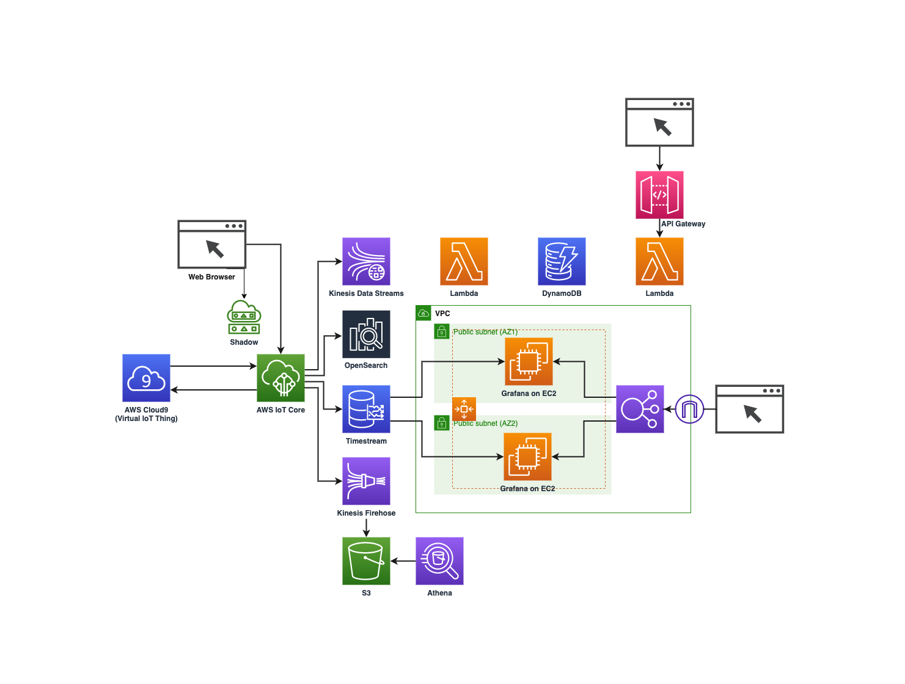

# AWS IoT Core Hands-on

This Repository is based on the following reference  
Ref: [AWS IoT Core for Beginners (Japanese)](https://catalog.us-east-1.prod.workshops.aws/workshops/b3e0b830-79b8-4c1d-8a4c-e10406600035/ja-JP)

## Dependencies

| Provider  | Version   |
|-----------|-----------|
| Terreform | ~> 1.5.1  |
| AWS       | ~> 4.67.0 |

<br>

# Architecting on AWS



<br>

# Usage

Change directory to project root

```shell
cd /path/to/project/root
```

Terraform Plan

```shell
make -f /path/to/project/root/Makefile -C terraform tf-plan
```

Deploy AWS Resources (destroy & apply)

```shell
make -f /path/to/project/root/Makefile -C terraform tf-deploy
```

Apply AWS Resources (only apply)

```shell
make -f /path/to/project/root/Makefile -C terraform tf-apply
```

Destroy AWS Resources

```shell
make -f /path/to/project/root/Makefile -C terraform tf-destory
```

Upload `./terraform/build_iot_devices.sh` to Cloud9 after `terraform apply`  
After that, run `sh ./build_iot_devices.sh` on Cloud9